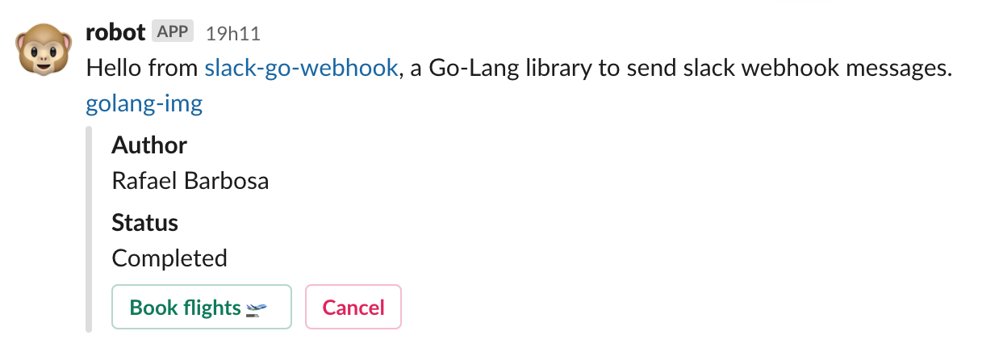

[](https://github.com/rafaelmilanibarbosa/slack-go)

# slack-go



Go Lang library to send messages to Slack via Incoming Webhooks.

## Usage
```go
package main

import "github.com/rafaelmilanibarbosa/slack-go"
import "fmt"

func main() {
    webhookUrl := "https://hooks.slack.com/services/foo/bar/baz"

    attachment1 := slack.Attachment {}
    attachment1.AddField(slack.Field { Title: "Author", Value: "Rafael Barbosa" }).AddField(slack.Field { Title: "Status", Value: "Completed" })
    attachment1.AddAction(slack.Action { Type: "button", Text: "Book flights 🛫", Url: "https://www.google.com/flights", Style: "primary" })
    attachment1.AddAction(slack.Action { Type: "button", Text: "Cancel", Url: "https://www.google.com/flights", Style: "danger" })
    payload := slack.Payload {
      Text: "Hello from <https://github.com/rafaelmilanibarbosa/slack-go|slack-go>, a Go-Lang library to send slack webhook messages.\n<https://golangschool.com/wp-content/uploads/golang-teach.jpg|golang-img>",
      Username: "robot",
      Channel: "#general",
      IconEmoji: ":monkey_face:",
      Attachments: []slack.Attachment{attachment1},
    }
    err := slack.Send(webhookUrl, "", payload)
    if len(err) > 0 {
      fmt.Printf("error: %s\n", err)
    }
}
```

## Test
```go
go run test.go
```

## Extras
```go
export GOROOT=/usr/local/go
export GOPATH=$HOME/YOUR-APP-PATH-FROM-GIT-CLONE/slack-go

go get -u github.com/parnurzeal/gorequest
go get -u github.com/slack-go/slack
go get -u github.com/rafaelmilanibarbosa/slack-go
```

## License
Licensed under the Apache License, Version 2.0: http://www.apache.org/licenses/LICENSE-2.0

